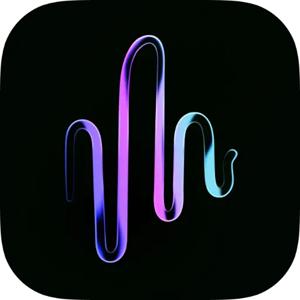

  

<h1 align="center">NotchLive</h1>

<strong>Real-time AI captions, translation, and session dictation — right in your MacBook's notch.</strong>

[Download Latest Release](https://github.com/lemberalla/notchlive-releases/releases/latest) · [Website](https://notchlive.app) · [How to Use](https://notchlive.app/how-to-use)

---

NotchLive turns your MacBook's notch into a live caption display and local speech-to-text workspace. Powered by on-device Whisper AI — everything stays on your Mac, nothing leaves.

## Features

- **Live Captions** — Real-time speech-to-text displayed in your notch
- **20 Translation Languages** — Translate captions on the fly (macOS 15+)
- **5 AI Models** — From Tiny (fastest) to Large Turbo (most accurate)
- **System Audio + Microphone** — Capture any app, your voice, or both
- **Auto Language Detection** — Recognizes 90+ spoken languages
- **Voice Notes** — Dictate, clean up, save, export, and send notes to NotchPad (Pro)
- **Session Recording** — Record sessions, keep Raw transcripts, generate AI dictation on demand, and export TXT/JSON (Pro)
- **Keyboard Shortcuts** — Start, stop, and switch modes hands-free
- **Works Without a Notch** — Caption bar appears at top center on any Mac

## System Requirements

- macOS 14 Sonoma or later
- Apple Silicon recommended
- Intel Macs supported

## Pricing

| | Free | Pro ($14.99 one-time) |
|---|---|---|
| Live captions | ✓ | ✓ |
| All AI models | ✓ | ✓ |
| System + mic audio | ✓ | ✓ |
| Keyboard shortcuts | ✓ | ✓ |
| Translation (20 languages) | | ✓ |
| Voice Notes | | ✓ |
| Session recording | | ✓ |
| Raw/AI transcript export | | ✓ |

## Privacy

All speech recognition happens locally using Whisper AI via CoreML. No cloud processing, no account required, no data collection.

## Install

1. Download the latest `.dmg` from [Releases](https://github.com/lemberalla/notchlive-releases/releases/latest)
2. Drag NotchLive to Applications
3. Grant Screen Recording and Microphone permissions when prompted
4. Pick an AI model and start captioning

## Translation Languages

Arabic, Chinese (Simplified), Chinese (Traditional), Dutch, English, French, German, Hindi, Indonesian, Italian, Japanese, Korean, Polish, Portuguese, Russian, Spanish, Thai, Turkish, Ukrainian, Vietnamese

## Links

- [Website](https://notchlive.app)
- [How to Use Guide](https://notchlive.app/how-to-use)
- [Privacy Policy](https://notchlive.app/privacy)

---

Made by [Tiny Things](https://tinythings.app)
